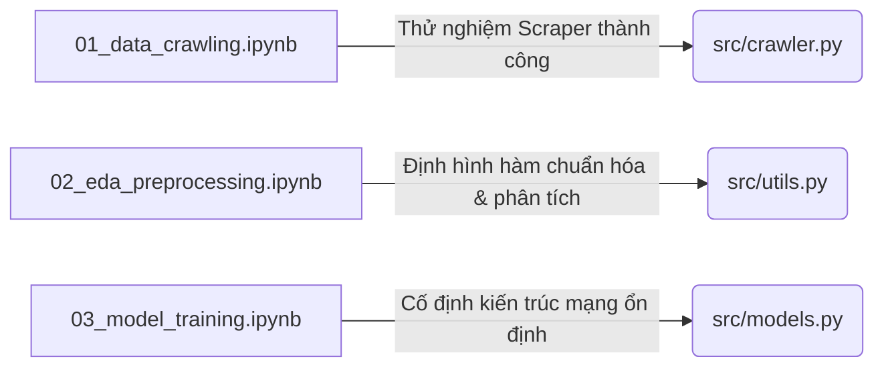
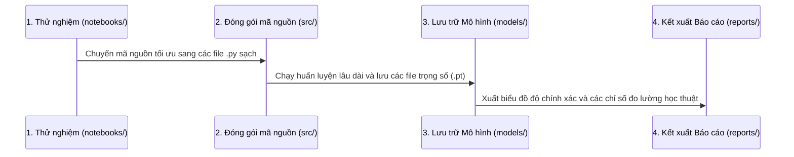

# 🌿 HƯỚNG DẪN KIẾN TRÚC & QUY TẮC CƠ BẢN PHÁT TRIỂN DỰ ÁN
> **Dự án:** Nhận Dạng Bệnh Cây Trồng (Plant Disease Classification)
> **Mục tiêu:** Quản lý vòng đời dữ liệu học sâu chuyên nghiệp và tối ưu hóa quy trình huấn luyện

---

## � **PHIÊN BẢN 2.2 - SECURITY BUILD** (Cập nhật)

**Phiên bản v2.2** bao gồm các sửa lỗi lõi và tối ưu hóa:

| Cải Tiến | Trạng Thái | Chi Tiết |
|----------|-----------|---------|
| **Atomic File Naming** | ✅ Sửa | Loại bỏ lỗ hổng chỉ số khi download thất bại |
| **Loại bỏ numpy** | ✅ Sửa | PIL thuần, không phụ thuộc numpy |
| **Driver Timeout** | ✅ Bổ sung | 30s timeout cho `driver.get()` |
| **Resume Chính Xác** | ✅ Sửa | Cập nhật next_file_idx từ file_counter |

**📖 Chi tiết:** Xem [FIXES_V2.2.md](./FIXES_V2.2.md) và [TESTING_V2.2.md](./TESTING_V2.2.md)

---

## �📑 Mục lục
1. [Sơ đồ Cấu trúc Toàn diện Dự án](#1-sơ-đồ-cấu-trúc-toàn-diện-dự-án)
2. [Quy tắc Cơ bản & Phân nhiệm của các Notebooks (`notebooks/`)](#2-quy-tắc-cơ-bản--phân-nhiệm-của-các-notebooks-notebooks)
3. [Quy trình Phát triển Hệ thống (Development Workflow)](#3-quy-trình-phát-triển-hệ-thống-development-workflow)
4. [Quy tắc Chọn lọc & Làm sạch Bộ Dữ liệu (Data Cleaning & Deduplication Rules)](#4-quy-tắc-chọn-lọc--làm-sạch-bộ-dữ-liệu-data-cleaning--deduplication-rules)
5. [Chiến lược Vượt qua Hệ thống Chống Bot (Anti-bot Evasion Strategies)](#5-chiến-lược-vượt-qua-hệ-thống-chống-bot-anti-bot-evasion-strategies)
6. [Nguyên tắc Quản lý Bộ dữ liệu (`data/`)](#6-nguyên-tắc-quản-lý-bộ-dữ-liệu-data)
7. [Cơ sở Lý luận & Biện luận Khoa học (Phục vụ Báo cáo Tiểu luận 35 trang)](#7-cơ-sở-lý-luận--biện-luận-khoa-học-phục-vụ-báo-cáo-tiểu-luận-35-trang)

---

## 1. Sơ đồ Cấu trúc Toàn diện Dự án

Dưới đây là sơ đồ tổ chức thư mục và tập tin chuẩn hóa của dự án. Cấu trúc này giúp phân tách rõ ràng giữa môi trường thử nghiệm nhanh (Notebooks), mã nguồn chạy chính thức (Scripts), dữ liệu qua các giai đoạn, và các báo cáo học thuật.

```text
plant-disease-classification/
│
├── data/                           # 📁 Quản lý vòng đời bộ dữ liệu
│   ├── raw/                        # Dữ liệu ảnh thô vừa crawl về (chưa lọc bỏ ảnh lỗi)
│   ├── processed/                  # Dữ liệu sạch sau khi lọc rác, chuẩn hóa định dạng & resize
│   └── augmented/                  # Dữ liệu đã qua bước Tăng cường dữ liệu (Data Augmentation)
│
├── notebooks/                      # 📁 Nơi chứa các file Jupyter Notebook (.ipynb) thử nghiệm
│   ├── 01_data_crawling.ipynb      # Code chạy thử nghiệm crawl ảnh và kiểm tra API/Scraper
│   ├── 02_eda_preprocessing.ipynb   # Code phân tích dữ liệu (EDA), vẽ biểu đồ, chuẩn hóa dữ liệu
│   └── 03_model_training.ipynb     # Code thiết kế mạng, chạy huấn luyện thử nghiệm và vẽ loss curves
│
├── src/                            # 📁 Mã nguồn cốt lõi dạng file Python (.py) chạy sản xuất
│   ├── __init__.py                 # Biến thư mục src thành một gói Python package
│   ├── crawler.py                  # Script crawl dữ liệu tự động hiệu năng cao (Selenium/Scrapy)
│   ├── utils.py                    # Các hàm bổ trợ (đọc/ghi file, cấu hình logging, vẽ đồ thị)
│   └── models.py                   # Định nghĩa các kiến trúc mạng Backbone (ResNet-50, MobileNet)
│
├── models/                         # 📁 Nơi lưu trữ trọng số mô hình sau huấn luyện
│   ├── resnet50_best.pt            # Trọng số tối ưu nhất của kiến trúc ResNet-50
│   └── mobilenet_best.pt            # Trọng số tối ưu nhất của kiến trúc MobileNet
│
├── reports/                        # 📁 Kết xuất học thuật và kết quả đánh giá mô hình
│   ├── figures/                    # Biểu đồ phân phối lớp, Loss/Accuracy curves, Confusion Matrix
│   └── evaluation.txt              # File text lưu các thông số chi tiết (Precision, Recall, F1-Score)
│
├── requirements.txt                # Danh sách các thư viện bắt buộc (selenium, torch, torchvision,...)
└── README.md                       # Tài liệu hướng dẫn quy tắc kiến trúc và vận hành hệ thống
```

---

## 2. Quy tắc Cơ bản & Phân nhiệm của các Notebooks (`notebooks/`)

Trong quy trình phát triển các bài toán Máy học (Machine Learning Pipeline), phân khu `notebooks/` đóng vai trò là **"Phòng thí nghiệm cát" (Sandbox)**. Tại đây, mọi thử nghiệm được diễn ra nhanh chóng dưới dạng tương tác trực quan trước khi đóng gói thành các đoạn mã nguồn chuẩn hóa trong `src/`.



### 📋 2.1. File `01_data_crawling.ipynb` (Thử nghiệm Crawl dữ liệu)
* **Nhiệm vụ:**
  - Viết nháp và thử nghiệm khả năng cào dữ liệu từ các nền tảng tìm kiếm ảnh (Google Images, Bing Images).
  - Kiểm tra tính đúng đắn của các selector (XPath, CSS selector) của thư viện cào ảnh.
  - Đo đạc tốc độ tải ảnh trung bình và kiểm tra các giới hạn chặn (IP blocking/Captcha) để điều chỉnh tham số thời gian chờ (`delay`).
* **Quy tắc cơ bản:**
  - Không chạy tải hàng loạt 10.000 ảnh ngay trên Notebook để tránh tràn bộ nhớ trình duyệt hoặc crash nhân Kernel.
  - Chỉ crawl thử nghiệm từ **5 - 10 ảnh** cho mỗi lớp để xác định thuật toán tải ảnh hoạt động chính xác trước khi chuyển giao mã nguồn sang file chạy nền tự động `src/crawler.py`.

### 📋 2.2. File `02_eda_preprocessing.ipynb` (Phân tích EDA & Chuẩn hóa)
* **Nhiệm vụ:**
  - **EDA (Exploratory Data Analysis):** Thống kê số lượng ảnh của từng lớp, kiểm tra tính cân bằng của dữ liệu (Class Imbalance) và trực quan hóa phân phối bằng biểu đồ cột.
  - **Kiểm tra chất lượng ảnh:** Xác định các tệp ảnh bị lỗi cấu trúc (corrupted file) không thể đọc được.
  - **Tiền xử lý:** Xây dựng quy trình chuẩn hóa ảnh (Loại bỏ kênh màu Alpha trong suốt, đổi định dạng đồng bộ sang `.jpg` và resize hàng loạt ảnh về $224 \times 224$ pixels).
* **Quy tắc cơ bản:**
  - Sử dụng các biểu đồ trực quan như Matplotlib và Seaborn để vẽ biểu đồ phân phối mẫu. Các biểu đồ chất lượng cao này sẽ được lưu vào thư mục `reports/figures/` để chèn vào báo cáo.

### 📋 2.3. File `03_model_training.ipynb` (Cấu trúc mạng & Huấn luyện)
* **Nhiệm vụ:**
  - Thiết kế và kiểm tra thử nghiệm đầu vào/đầu ra của các kiến trúc mạng học sâu backbone (ResNet-50, MobileNet).
  - Cấu hình siêu tham số (Hyperparameters) thử nghiệm như: Tốc độ học (Learning Rate), Kích thước lô (Batch Size), Hàm tối ưu (Optimizer) và Hàm mất mát (Loss Function).
  - Chạy thử nghiệm huấn luyện vài Epochs (chu kỳ) ngắn để kiểm tra sự hội tụ của mô hình và vẽ đồ thị biểu diễn Loss/Accuracy.
* **Quy tắc cơ bản:**
  - Cần ghi lại và so sánh nhật ký huấn luyện giữa các lần thử nghiệm (thay đổi LR, Optimizer).
  - Khi cấu hình tối ưu đã được xác định, toàn bộ kiến trúc mạng cốt lõi phải được chuyển sang `src/models.py` để thuận tiện cho việc chạy huấn luyện chính thức với thời gian dài trên máy chủ GPU.

---

## 3. Quy trình Phát triển Hệ thống (Development Workflow)

Để dự án vận hành mượt mà và chuyên nghiệp, toàn bộ các thành viên hoặc lập trình viên cần tuân thủ nghiêm ngặt **Quy trình 4 bước** sau:



1. **Bước 1: Phát triển thử nghiệm nhanh:** Thực hiện toàn bộ các ý tưởng cào dữ liệu, lọc rác, trực quan hóa và thiết kế mạng trên 3 file tương ứng trong `notebooks/`.
2. **Bước 2: Chuẩn hóa mã nguồn:** Khi các thử nghiệm đã chạy ổn định và đạt kết quả mong muốn, chuyển toàn bộ các đoạn code rời rạc trên Notebook thành các hàm (functions) và lớp (classes) sạch sẽ, viết vào các tệp tương ứng trong `src/`.
3. **Bước 3: Vận hành huấn luyện tự động:** Chạy huấn luyện chính thức bằng cách gọi các mã nguồn trong `src/` qua dòng lệnh (Terminal) để hệ thống chạy ổn định lâu dài. Khi kết thúc huấn luyện, mô hình có độ chính xác cao nhất (Best Epoch) sẽ tự động được lưu vào thư mục `models/`.
4. **Bước 4: Trình bày học thuật:** Sử dụng các kết quả huấn luyện, biểu đồ ma trận nhầm lẫn (Confusion Matrix), biểu đồ Loss, và file `evaluation.txt` trong thư mục `reports/` để tổng hợp số liệu và viết báo cáo chuyên sâu.

---

## 4. Quy tắc Chọn lọc & Làm sạch Bộ Dữ liệu (Data Cleaning & Deduplication Rules)

Để xây dựng một bộ dữ liệu chất lượng cao phục vụ huấn luyện mô hình sâu, toàn bộ $3.000$ hoặc $10.000$ bức ảnh cào về phải đi qua một bộ lọc làm sạch nghiêm ngặt tích hợp trong file `02_eda_preprocessing.ipynb` và `src/data_cleaning.py`. Bộ lọc này dựa trên **5 Tiêu chí Học thuật cốt lõi**:

### 🔹 4.1. Tiêu chí về tính duy nhất (Bản sao trùng lặp)
Trong quá trình cào dữ liệu, việc thu thập phải các bản ghi trùng lặp thường xuyên xảy ra do sự trùng lặp phân trang (pagination overlaps) hoặc do hệ thống tự động tải lại khi gặp lỗi (crawler retries). 
*   **Giải pháp:** Áp dụng thuật toán so khớp URL/ID hoặc tính toán mã băm MD5/SHA-256 của tệp ảnh vật lý để phát hiện các ảnh giống hệt nhau.
*   **Cú pháp Pandas lọc trùng dựa trên siêu dữ liệu:**
    $$\texttt{df.drop\_duplicates(subset=['url'], keep='first')}$$
    Chỉ giữ lại bản ghi xuất hiện đầu tiên và tiến hành xóa vật lý tất cả các file trùng lặp tiếp theo trên ổ cứng để tránh việc một ảnh bị mô hình học lại nhiều lần gây sai lệch độ chính xác.

### 🔹 4.2. Tiêu chí về dữ liệu khuyết thiếu (Missing Data)
Các bản ghi siêu dữ liệu (metadata) không đầy đủ như thiếu liên kết ảnh (`url`), thiếu kích cỡ, hoặc thiếu nhãn tên lớp bệnh trồng trọt sẽ không có giá trị huấn luyện.
*   **Giải pháp:** Đánh giá bản chất dữ liệu khuyết thiếu. Nếu thuộc loại **Khuyết thiếu hoàn toàn ngẫu nhiên (MCAR - Missing Completely at Random)** do mất kết nối mạng nhất thời và chiếm tỷ lệ cực kỳ nhỏ (dưới $5\%$), phương pháp an toàn nhất là xóa bỏ các bản ghi đó khỏi danh mục huấn luyện để đảm bảo độ tin cậy.

### 🔹 4.3. Tiêu chí về ngoại lệ (Outliers Detection bằng phương pháp IQR)
Ảnh rác thường bao gồm các tệp rất nhỏ (icon trang web, ảnh logo, avatar có kích thước dưới 1KB) hoặc các ảnh sơ đồ kỹ thuật cực kỳ lớn không chứa thông tin đặc trưng của lá cây.
*   **Giải pháp:** Áp dụng **phương pháp Dải phân vị (IQR - Interquartile Range)** trên dung lượng tệp (KB) hoặc kích thước pixel (Width/Height) của ảnh thô:
    1.  Tính toán $Q_1$ (phân vị 25%) và $Q_3$ (phân vị 75%).
    2.  Xác định khoảng biến thiên nội phân vị: $IQR = Q_3 - Q_1$.
    3.  Thiết lập ranh giới quyết định: các tệp ảnh có kích thước nằm ngoài dải từ $[Q_1 - 1.5 \times IQR]$ đến $[Q_3 + 1.5 \times IQR]$ sẽ bị gắn cờ ngoại lệ (outlier) và xóa bỏ hoàn toàn.

### 🔹 4.4. Tiêu chí về tính nhất quán của nhãn (Text Normalization)
Ảnh thu thập từ nhiều nguồn có thể bị gán nhãn không đồng nhất hoặc bị sai lệch ký tự do lỗi đánh máy trên trang nguồn (Ví dụ: `Rice_blast`, `rice  blast`, `Rice__Blight`).
*   **Giải pháp:** Tiền xử lý văn bản bằng cách chuyển đổi toàn bộ nhãn về chữ thường (lowercase), loại bỏ các khoảng trắng thừa ở hai đầu và ở giữa (whitespace stripping), chuẩn hóa ký tự nối thành dấu gạch dưới `_`. Nếu sau khi chuẩn hóa, nhãn vẫn không thuộc vào danh sách lớp mục tiêu, tệp ảnh sẽ bị loại bỏ lập tức.

### 🔹 4.5. Tiêu chí về tính toàn vẹn của tệp vật lý (Image Integrity)
Các ảnh tải về có thể bị lỗi định dạng hoặc hỏng cấu trúc nhị phân do đường truyền đứt quãng trong quá trình tải xuống.
*   **Giải pháp:** 
    *   Tự động phát hiện và xóa bỏ các tệp tải nhầm không phải ảnh (như các trang HTML lỗi, file PDF).
    *   Quét và loại bỏ các tệp trống có dung lượng bằng 0KB.
    *   Sử dụng thư viện Pillow hoặc OpenCV để thử mở tệp ảnh vật lý bằng hàm `Image.open()`. Nếu tệp phát sinh lỗi giải mã (corrupted image), tiến hành gọi lệnh `unlink()` để xóa bỏ file đó khỏi ổ cứng.

---

## 5. Chiến lược Vượt qua Hệ thống Chống Bot (Anti-bot Evasion Strategies)

Để vượt qua các hệ thống Anti-bot tiên tiến (như Cloudflare, DataDome, PerimeterX) khi cào một lượng lớn ảnh (như 3.000 ảnh lúa), hệ thống cào dữ liệu áp dụng một chiến lược đa lớp, kết hợp việc ngụy trang ở cấp độ trình duyệt, thao tác mạng, và mô phỏng hành vi con người.

### 🛡️ 5.1. Khắc phục dấu vân tay trình duyệt (Browser Fingerprinting)
Hầu hết các hệ thống Anti-bot hiện đại có thể dễ dàng phát hiện ra các công cụ tự động hóa tiêu chuẩn thông qua dấu vân tay trình duyệt. Các giải pháp vượt qua bao gồm:
*   **Loại bỏ cờ tự động hóa:** Trình duyệt Selenium tiêu chuẩn sẽ để lộ cờ `navigator.webdriver = true` và các chuỗi định danh đặc trưng (như `$cdc_`). Việc sử dụng **Nodriver** (giao tiếp trực tiếp qua giao thức CDP) hoặc **Undetected ChromeDriver** sẽ tự động vá các lỗ hổng này, giúp bot trông giống trình duyệt thực tế.
*   **Tránh dùng Headless thuần túy:** Chế độ ẩn giao diện (Headless) dễ bị phát hiện do thiếu driver màn hình vật lý, hiển thị sai WebGL hoặc độ phân giải mặc định phi thực tế. Hãy chạy trình duyệt ở chế độ có giao diện (Headed mode), hoặc sử dụng cờ `--headless=new` trên Chrome 112+ để giả lập môi trường trình duyệt đầy đủ.

### 🛡️ 5.2. Quản lý mạng và tính nhất quán của Headers
*   **Xoay vòng Proxy dân cư:** Bất kỳ IP đơn lẻ nào tải hàng ngàn bức ảnh trong thời gian ngắn đều sẽ bị giới hạn lưu lượng (Rate Limit) hoặc chặn IP. Giải pháp là phân tán các yêu cầu qua một nhóm IP proxy, ưu tiên dùng Proxy dân cư (Residential Proxies) cung cấp danh tính người dùng internet thực để tránh bị liệt vào danh sách đen.
*   **Đồng bộ IP và Headers:** Khi xoay vòng User-Agent để mô phỏng các thiết bị khác nhau, các Headers phải khớp logic với IP. Hệ thống sẽ ngay lập tức chặn nếu phát hiện sự bất hợp lý (ví dụ: IP di động ở Đức nhưng User-Agent lại khai báo là trình duyệt Safari trên hệ điều hành MacOS).
*   **Giả mạo TLS Fingerprint (JA3/JA4):** Hệ thống tường lửa WAF phân tích kết nối mã hóa TLS trước khi JavaScript chạy. Có thể sử dụng các thư viện chuyên dụng như `curl_cffi` để giả mạo quá trình bắt tay TLS (TLS handshake) của Chrome hoặc Safari thực tế nhằm ẩn danh triệt để.

### 🛡️ 5.3. Mô phỏng hành vi tự nhiên (Behavioral Simulation)
Hành vi của máy móc rất nhanh và đều đặn, trong khi con người có xu hướng phi tuyến tính. Hệ thống cào dữ liệu được "làm chậm lại" và thêm các yếu tố ngẫu nhiên:
*   **Độ trễ ngẫu nhiên (Jitter Delays):** Tránh tải ảnh với tốc độ đều đặn hoặc gửi yêu cầu liên tục. Thêm các khoảng chờ ngẫu nhiên từ 0.5 đến 3 giây giữa các lần tải ảnh hoặc chuyển trang.
*   **Tương tác và điều hướng (Natural Navigation):** Thay vì chọc thẳng tới các tệp ảnh ẩn sâu, bot nên truy cập vào trang chủ trước, sau đó cuộn trang từ từ (scroll) và mô phỏng việc di chuyển/nhấp chuột để đánh lừa các cơ chế theo dõi hành vi chuột của Anti-bot.
*   **Duy trì phiên hoạt động (Session Management):** Lưu trữ lại Cookies và Local Storage qua mỗi lần tải. Việc giữ lại session giúp bot giống một người dùng hợp lệ đang quay trở lại trang web.

### 🛡️ 5.4. Chiến lược Throttling và Xử lý Lỗi
*   **Hàng đợi phân tán (Task Queues):** Sử dụng các hệ thống hàng đợi công việc để giới hạn số lượng luồng cào song song (concurrency). Việc này giúp điều tiết lưu lượng (throttling), phân bổ lệnh tải ảnh đồng đều thay vì dồn dập tấn công máy chủ đích.
*   **Exponential Backoff kèm Jitter:** Khi nhận được lỗi giới hạn truy cập (như `429 Too Many Requests`), sử dụng chiến lược lùi thời gian thử lại theo cấp số nhân (ví dụ: đợi 1s, rồi 2s, 4s, 8s...) kết hợp với một khoảng thời gian nhiễu ngẫu nhiên (jitter) để phá vỡ các quy luật dễ bị nhận diện.

---

## 6. Nguyên tắc Quản lý Bộ dữ liệu (`data/`)

Bộ dữ liệu $10.000$ ảnh được phân chia và kiểm soát chặt chẽ qua 3 phân vùng độc lập nhằm đảm bảo tính toàn vẹn của dữ liệu học máy:
1. **`data/raw/` (Ảnh thô):** Giữ nguyên gốc 100% dữ liệu tải về từ công cụ cào ảnh. Không thực hiện bất kỳ thao tác chỉnh sửa, cắt ghép hay thay đổi tên file nào tại đây. Đây là tài liệu gốc phục vụ việc kiểm toán độ tin cậy của bộ dữ liệu.
2. **`data/processed/` (Ảnh sạch):** Nơi lưu trữ bộ ảnh sau khi đã đi qua bộ lọc nhiễu thủ công và chạy tiến trình resize tự động về $224 \times 224$ pixels. Kích thước này là chuẩn mực giúp mô hình hội tụ nhanh và tối ưu hóa bộ nhớ GPU.
3. **`data/augmented/` (Ảnh tăng cường):** Chỉ áp dụng các kỹ thuật xoay, lật, tăng giảm độ tương phản từ ảnh sạch để nhân bản số lượng mẫu cho tập **Huấn luyện (Train)**. Tuyệt đối **không** tăng cường ảnh trên tập **Kiểm định (Val)** và **Kiểm thử (Test)** để tránh hiện tượng rò rỉ thông tin dữ liệu (Data Leakage).

---

## 7. Cơ sở Lý luận & Biện luận Khoa học (Phục vụ Báo cáo Tiểu luận 35 trang)

*Dưới đây là các lập luận học thuật đắt giá giúp bạn trực tiếp đưa vào phần Biện luận Kiến trúc Hệ thống trong bài báo cáo chuyên sâu của mình để đạt điểm tuyệt đối từ giảng viên.*

### 📂 7.1. Ý nghĩa khoa học của việc tách biệt giữa Notebook và Script (.py)
* **Khắc phục tính phi tuyến tính của Jupyter Notebook:** Một trong những nhược điểm lớn của Notebook là thứ tự thực thi của các ô lệnh (cells) có thể bị xáo trộn bởi người dùng, dẫn đến trạng thái biến (state) bị sai lệch trong bộ nhớ RAM, gây ra lỗi ẩn trong mô hình. 
* **Tối ưu hóa sản xuất (Production-ready):** Việc chuyển đổi mã nguồn tối ưu sang `src/` đảm bảo tính đóng gói (encapsulation), khả năng chạy nền (background tasks) trên máy chủ từ xa thông qua các câu lệnh Terminal mà không cần duy trì giao diện web của Jupyter, đồng thời giúp mã nguồn dễ dàng được kiểm thử tự động (Unit Test).

### 📐 7.2. Biện luận về Quản lý Vòng đời Dữ liệu theo kiến trúc Raw -> Processed -> Augmented
* **Tính độc lập của dữ liệu đánh giá:** Bằng việc phân tách rõ ràng cấu trúc dữ liệu, dự án ngăn chặn triệt để lỗi **Data Leakage (Rò rỉ dữ liệu)**. Trong nghiên cứu học sâu, nếu quá trình Tăng cường dữ liệu (Augmentation) được thực hiện trước khi chia tập Train/Val/Test, mô hình sẽ bị đánh giá quá cao một cách sai lệch (quá khớp giả tạo) do tập kiểm thử chứa các ảnh biến thể của tập huấn luyện. 
* **Kiểm chứng học thuật:** Việc cô lập các tập `val` và `test` trong thư mục `processed/` và chỉ thực hiện tăng cường trong `augmented/` đảm bảo tính khách quan tối đa, giúp phản ánh chính xác khả năng tổng quát hóa (generalization) của mạng nơ-ron khi ứng dụng thực tế trên đồng ruộng.

### 🧠 7.3. Tối ưu hóa cấu trúc thư mục phục vụ nạp dữ liệu tự động
* **Giảm thiểu độ phức tạp thuật toán nạp tin:** Cấu trúc phân lớp dạng thư mục con bên trong `processed/` và `augmented/` tương thích trực tiếp với các hàm nạp dữ liệu chuẩn mực của các thư viện lớn như `torchvision.datasets.ImageFolder` của PyTorch hay `image_dataset_from_directory` của TensorFlow.
* **Hiệu năng hệ thống:** Việc nạp dữ liệu theo cấu trúc này giúp các Generator/DataLoader có thể thực hiện tải ảnh song song đa luồng (Multi-threading), giảm thiểu thời gian chờ của GPU (GPU starvation) giữa các bước huấn luyện, nâng cao hiệu suất tính toán tổng thể lên gấp nhiều lần.
